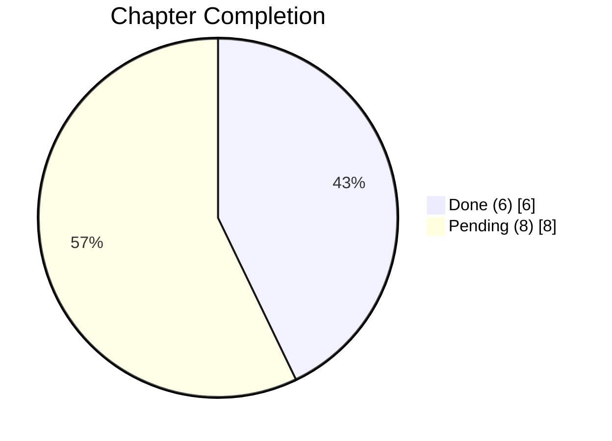

# Teach Yourself C

<p align="center">
  <b>Learning record repository for "Teach Yourself C"</b>
</p>

<p align="center">
  
  
  
  
  
  
</p>

## Overview

This repository stores:
- chapter-based exercise code
- buildable project configuration

## Repository Map

```text
.
├── Chap02/ .. Chap06/   # Chapter code
├── CMakeLists.txt       # Project build configuration
├── .clang-format        # Formatting rules
└── .clangd              # clangd settings (uses build DB)
```

## Quick Start

### 1. Configure

```sh
cmake -S . -B build -DCMAKE_EXPORT_COMPILE_COMMANDS=ON
ln -sf build/compile_commands.json compile_commands.json
```

### 2. Build

```sh
cmake --build build -j
```

### 3. Run (example)

```sh
./build/Chap06_ch06-00
```

## Progress

`Completion: 6 / 14 chapters`

```text
[████████░░░░░░░░░░] 42.9%
```



| Chapter | Status |
| --- | --- |
| 1. Setup for Learning |  |
| 2. Basics of C |  |
| 3. Numbers and Variables |  |
| 4. Control Flow: Booleans and Branching |  |
| 5. Control Flow: Arrays and Loops |  |
| 6. Control Flow: Conditional Loops |  |
| 7. Characters and Strings |  |
| 8. Addresses and Pointers |  |
| 9. Writing Functions |  |
| 10. Input and Output |  |
| 11. Structures |  |
| 12. Unions and Bit Fields |  |
| 13. Advanced Types and Operators |  |
| 14. Preprocessor |  |

## License

Personal study project.
